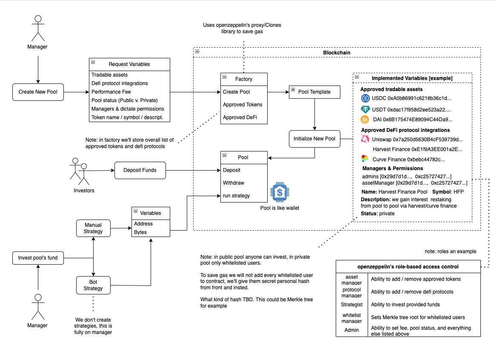

# Investment strategy contracts

# Description

### Contract system

The smart contract system for the platform has one central contract (Factory) that is able to control: libraries, platforms, assets, fees, and create new Pool contracts. The Pool contract is responsible for all actions on the platform. It is capable of calling external libraries to interact with third-party protocols. The Pool contract also acts as a repository for data and investor funds. Additional libraries that are linked to the Pool contract have the ability to call third-party protocols and perform specified actions directly.

# Architecture



# Project structure

```
.
├──  contracts/ # contracts
├────── interfaces/ # interfaces
├────── lib/ # libraries that have the ability to interact with the main contract
├────── mock/ # mock contracts
├────── FactoryLogic.sol # Factory implementation logic contract
├────── FactoryProxy.sol # Factory proxy contract
├────── PoolLogic.sol # Pool implementation logic contract
├────── PoolProxy.sol # Pool proxy contract
├──  scripts/ # scripts for deploy and interaction
├──  test/ # test cases
├──  README.md # current file
├──  .env.sample # example of .env file
├──  .gitignore
├──  hardhat.config.js # config for deploying or testing on various networks
└──  package.json
```

# Local development

## Prerequisites

- [node v15.11.0](https://www.npmjs.com/package/node/v/15.11.0) or higher
- [hardhat v2.14.0](https://www.npmjs.com/package/hardhat/v/2.14.0)
- [solidity v0.8.19](https://github.com/ethereum/solidity/releases/tag/v0.8.19)

## .ENV

Setup .env file

- `INFURA_KEY` - infura api key for upload contracts to test network
- `RPC_URL` - RPC provider link
- `PRIVATE_KEY` - private key
- `ETHERSCAN_API_KEY` - etherscan api key for verify contracts

# Install the dependencies

- Install node_modules

```
npm i
```

OR

```
yarn install
```

- Compile the contracts

```
npx hardhat compile
```

- Run the tests

```
npx hardhat test
```

- Coverage the contracts

```
npx hardhat coverage
```

- Get size of contracts

```
npx hardhat size-contracts
```

# Smart contracts

| **Main Contracts** | Description                                                                                                                     |
| ------------------ | ------------------------------------------------------------------------------------------------------------------------------- |
| FactoryProxy       | Factory upgradable proxy contract.                                                                                              |
| FactoryLogic       | Factory logic implementation used to manage the project and create new Pool contracts.                                          |
| PoolProxy          | Proxy upgradable proxy contract.                                                                                                |
| PoolLogic          | Proxy logic implementation used to interact with external libraries, call basic project functions and store all funds and data. |

| **Library Contracts** | Description                                                                        |
| --------------------- | ---------------------------------------------------------------------------------- |
| FuturesLibrary        | Library for Futures functionality.                                                 |
| LendBorrowLibrary     | Library for _Venus_ functionality.                                                 |
| PoolLibrary           | Library includes calculation methods, spot trading logic, and structured products. |
| RevertReasonParser    | Library for error detection.                                                       |

## Smart contract descriptions

### Factory

#### Capabilities:

##### For user:

- Create Pool;
- Get params information;
- Get pool information;

##### For manager:

- Set libraries;
- Set implementations;
- Manage assets;
- Manage platforms;

#### Contract methods:

- `createPool` - Function for creating a new Pool contract with specified parameters.
- `setPoolLogic` - **only Manager** Set different pool logic to use.
- `setDexLibs` - **only Manager** Set new library for exchange tokens.
- `setVenusLibs` - **only Manager** Set new Venus library.
- `setUniAddresses` - **only Manager** Set new Spot trading library.
- `manageLibrariesToWhitelist` - **only Manager** Add new assets to whitelistedLibraries.
- `manageAssetsToWhitelist` - **only Manager** Add new assets to whitelistedAssets.
- `managePlatformsToWhitelist` - **only Manager** Add new platforms to whitelistedAssets.
- `setTreasuryFundAndFee` - **only Manager** Set new platform fee.
- `setPoolLibrary` - **only Manager** Set pool library contracts.
- `setHorizonProtocolLib` - **only Manager** Set structured products library.
- `setLendBorrowLib` - **only Manager** Set Venus library.
- `setFuturesLib` - **only Manager** Set Futures library.
- `getRouterAddress` - Get router address.
- `getPools` - Get info about pools.
- `getPoolAddresses` - Get created pool addresses.
- `getWhitelistedAssets` - Get whitelisted assets.
- `getWhitelistedPlatforms` - Get whitelisted platforms.
- `getDexLibraryData` - Get Dex library.
- `getVenusLibraryData` - Get Venus address.
- `getUniAddresses` - Get Spot trading.
- `getHorizonProtocolLib` - Get Structured products library
- `getFuturesLib` - Get Futures library.
- `getPoolLibraryAddress` - Get pool library.
- `getLendBorrowLibraryAddress` - Get Venus library.
- `getTreasuryAddressAndFee` - Get fee value.

### Pool

#### Capabilities:

##### For user:

- Invest;
- Withdraw;
- Get pool info and pool data;

##### For manager:

- Manage investors;
- Open/Close pool;
- Use fund for strategies;
- Manage fees;

#### Contract methods:

- `invest` - Allows user invest funds to pool.
- `withdraw` - Allows user withdraw funds from pool.
- `directCallStrategy` - **only Manager** Call a contract with the specified data.
- `libraryCall` - **only Manager** Call library contract with data by delegatecall.
- `enter` - **only Manager** Enter in Pancakeswap pair.
- `exit` - **only Manager** Exit from Pancakeswap pair to chosen token.
- `setDirectCallAllowance` - **only Manager** Set direct call allowance.
- `setPublishStatus` - **only Manager** Set publish pool status.
- `closePool` - **only Manager** Close pool for use.
- `setMinInvestmentAmount` - **only Manager** Sets a minimum amount below which investments cannot be made.
- `setFeeCollectorAndFee` - **only Manager** sets new fee collector and fee percentage.
- `getFeeCollected` - get amount of fee.
- `checkUnderlyingTokens` - check pairs for pancakeswap.
- `getFactoryAddress` - Get factory address.
- `getFeePercentage` - Get fee percentage.
- `getSupportLiquidityPairs` - get support liquidity pairs.
- `assetsUnderManagement` - The function of calculating all the assets of this pool.
- `poolInfo` - Complete information about the this pool.
- `getInvestors` - get investor addresses.

# Scripts

_You should make sure that all settings and ABIs are set up as you need them and the `.env` file is created and contains the correct credentials._

## Deploy Factory

### Deploy Factory (for testnet)

To deploy Factory for testnet, you should use the command: `npx hardhat run scripts/deploy.js --network TEST_NETWORK_NAME`

### Deploy Factory (for mainnet)

To deploy Factory for mainnet, you should use the command: `npx hardhat run scripts/deploy-bsc.js --network bsc`

## Crate Pool (for mainnet or testnet)

To create a pool, you should use the command: `npx hardhat run scripts/createPoll.js --network NETWORK_NAME`

## Enter (for mainnet)

To enter a liq pool, you should use the command: `npx hardhat run scripts/enter.js --network bsc`

## Invest (for mainnet)

To Invest in a pool, you should use the command: `npx hardhat run scripts/invest.js --network bsc`

## Withdraw (for mainnet)

To Withdraw from a pool, you should use the command: `npx hardhat run scripts/withdraw.js --network bsc`

## Set new pool library (for mainnet or testnet)

To Set new pool library, you should use the command: `npx hardhat run scripts/setPoolLib.js --network NETWORK_NAME`

## Deploy new Library (for mainnet)

To deploy the required library you should to modify the script for the specific library you need (an example of a LendBorrowLibrary deployment is provided in the script).
Use the following command to call the script: `npx hardhat run scripts/deploy-lib.js --network bsc`

# Usage

Contracts are processed in the following stages:

1. Compilation
2. Deployment
3. Configuration
4. Interactions on-chain

## Compilation

To compile the contracts run:

```
npx hardhat compile
```

Artifacts are stored in the `artifacts` and directory.

## Deployment

For deployment step the following command should be used:

```
npx hardhat run scripts/deploy.js --network
```

OR

```
npx hardhat run scripts/SCRIPT_NAME --network
```

_Addresses of deployed contracts are displayed in terminal._

## Testing

If you'd like to run tests on the local environment, you might want to run tests using the following command:

```
npm run test
```

If you'd like to run tests on the fork node environment, you might want to run tests using the following command:

1. Start fork node:

```
ganache-cli --fork https://bsc-dataseed2.binance.org/
```

2. Uncomment the test called: `PoolFork.test.js`.
3. Comment (hide) the all other tests.
4. Run test:

```
npx hardhat test --network localhost
```

# Next Steps

1. Divide the functionality within PoolLibrary into separate libraries (Spot trading and Structured Products);
2. Add support for new libraries (Spot trading and Structured Products) in the `Factory` and be able to add them to `PoolLogic`;
3. Check for new libraries when calling `libraryCall`;
4. Fix inaccurate way to calculate `getBorrowedPercentage` (logic with additional percentage). `PoolLibrary.sol::Line(257-260);`
5. Add position fee calculation in `FuturesLibrary`. This feature requires a copy of LevelFinance’s `_calcPositionFee` function, which has some internal dependencies such as `borrowIndex` calculation, which uses the `_accrueInterest` function.

